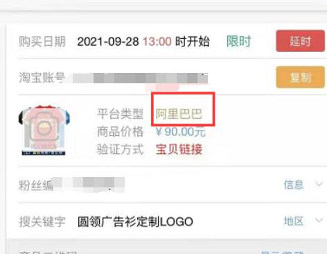
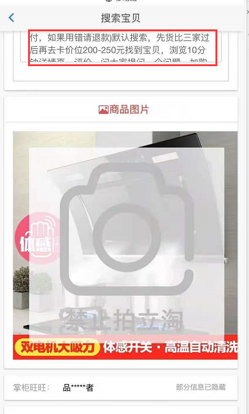

### 问题汇总

#### 货款不一致

1. ##### 运费超支问题

   - ①运费找客服免（说朋友介绍来的）
   - ②免不了的，发送以下内容给我
     - 淘宝号编号
     - 客服协商过程截图
     - 订单详细支付明细截图

2. ##### 链接正确价格不一致

   - ①使用店铺优惠凑价格
   - ②凑不齐价格情况下，买次低价（比货款稍低）
   - ③最低型号仍比货款高，发送以下内容给我
     - 淘宝号编号
     - 商品型号价格详情截图
     - 说明所遇问题（货款低于最低型号售价）
   - **链接验证通过的情况下**，价格与货款不同/价格与货款差距过大（几百几千）
     - 点开店铺查看全部宝贝，寻找照片一致不同的商品，进行验证

#### 找不到商品

1. ##### 关键字特殊

   - 关键字为以下情况：关键字、二维码、淘口令
   - 关键字、二维码
     - **按图片上店铺名进行搜索**，进入店铺-查找全部商品，按图片找商品。
     - 图片没有上没有店铺名，发送以下信息给我
       - 淘宝号编号
       - 描述所遇问题（特殊关键字且图片无店铺名）
   - 淘口令
     - 在任务-验证链接界面，有一个淘口令，复制进淘宝即可

2. ##### 图片一致，链接验证失败

   - ①点开店铺查看全部宝贝，寻找照片一致不同的商品，进行验证
   - ②看清是：“链接验证” 还是 “淘口令验证”

3. ##### 下单平台不对

   - 查看是淘宝平台还是阿里巴巴平台下单
   - 阿里巴巴平台，需要下载阿里巴巴app搜索商品（方法和淘宝一样）
   - 

4. 商品找不到（五分钟以上找不到）

   - 仔细查看任务界面是否有搜索范围提醒
   - 
   - 按以上都找过之后，仍找不到发送淘宝号编号给我，并描述问题

#### 超时

1. ##### 任务链接超时

   - 发送一元超时红包，并说明淘宝号编号

#### 任务开始货款未到

1. ##### 货款未到

   - 找到商品，只提交订单，不付款，在任务界面输入要求的内容（订单编号或手机号），先完成任务
   - 当天晚8点前必打款，***打款后及时付款***
   - **提交订单未付款导致订单关闭，按未拍处理，罚27元**

